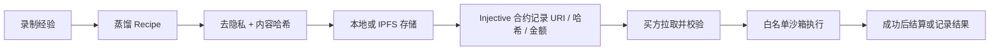

# Injenium · 灵枢

Injenium 是运行在 dimOS 上的机器人技能市场：机器人把经验蒸馏为去隐私、参数化的
`Recipe`，通过 Injective EVM 发布请求、应答或技能挂牌，并只在本机白名单沙箱中执行。
链上保存交易状态、金额、配方 URI 和内容哈希；配方正文与机器人数据不上链。

当前参考实现是 Unitree Go2。`injenium.core` 是与机器人无关的市场内核，
`injenium.domains.go2` 负责 Go2 原语、provider 和经验蒸馏。

## 全流程与实现难度

按顺序推进，不要跳过前一阶段的验收门槛。

| 阶段 | 内容 | 难度 | 资金风险 | 验收门槛 |
| --- | --- | --- | --- | --- |
| 0 | dimOS 环境与蓝图注册 | 低 | 无 | 能看到 `injenium.market` / `injenium.agentic` |
| 1 | mock 市场与沙箱 | 低 | 无 | M3、M4 完成且危险配方被拒绝 |
| 2 | Anvil 本地真 EVM | 中 | 无 | 合约闭环真实签名、托管、放款 |
| 3 | Injective 测试网 | 中 | 测试币 | Blockscout 可核对全部交易 |
| 4 | Go2 真机 + mock | 高 | 无 | 两台机器完成请求、执行、中止和恢复 |
| 5 | Go2 真机 + 测试网 | 高 | 测试币 | 跨机 IPFS、链上状态和物理动作一致 |
| 6 | Injective 主网 | 很高 | 真实 INJ | 审计、限额、监控、密钥和回滚方案全部就绪 |



## 目录结构

- `injenium/core/`：配方、沙箱、身份、存储、市场技能和链客户端。
- `injenium/domains/go2/`：Go2 原语白名单、mock/真机 provider、蒸馏器和蓝图。
- `contracts/src/Market.sol`：Injective EVM 市场合约；ABI 必须与
  `injenium/core/chain/client.py` 同步。
- `demo/`：M2-M5 手动端到端验收。
- `INTEGRATION.md`：机器接入细则；`TESTING.md`：分层测试；
  `TESTNET_NOTES.md`：测试网问题记录。

## 0. 配置开发环境

要求 Python 3.10-3.12，并把 Injenium 安装到 **dimOS 自己的虚拟环境**。本机约定：

```bash
export DIMOS_ROOT=/Users/mac/twork/dimos
export INJENIUM_ROOT=/Users/mac/twork/injenium
export DIMOS_BIN="$DIMOS_ROOT/.venv/bin/dimos"
export PYTHON_BIN="$DIMOS_ROOT/.venv/bin/python"

cd "$DIMOS_ROOT"
uv sync --extra unitree

cd "$INJENIUM_ROOT"
uv pip install --python "$PYTHON_BIN" -e '.[chain]'
"$DIMOS_BIN" list | rg injenium
```

新机器可先使用 dimOS 官方安装脚本，再确认实际安装路径并设置上述变量：

```bash
curl -fsSL https://raw.githubusercontent.com/dimensionalOS/dimos/main/scripts/install.sh | bash
```

预期能发现 `injenium.market`（无头验收）和 `injenium.agentic`（完整 Go2）。

## 1. 跑通无链闭环

```bash
cd "$INJENIUM_ROOT"
"$PYTHON_BIN" demo/demo_m3_sandbox.py
"$PYTHON_BIN" demo/demo_m4_mock_loop.py --db /nonexistent
```

M3 应执行白名单动作并拒绝不安全步骤；M4 应完成
`publish -> offer -> accept/run -> pay/rate` 以及取消退款。

再验证真实 dimOS MCP 接口。第一个终端运行：

```bash
"$DIMOS_BIN" run injenium.market --zenoh-scouting true --n-workers 4
```

第二个终端运行：

```bash
"$DIMOS_BIN" mcp list-tools
"$DIMOS_BIN" mcp call chain_status
"$DIMOS_BIN" mcp call list_requests
```

应发现 13 个市场技能。金额必须以十进制字符串传入，例如：

```bash
"$DIMOS_BIN" mcp call publish_request \
  --json-args '{"need":"climb the ramp","budget":"0.1"}'
```

## 2. 用 Anvil 验证真实合约

先安装 Foundry，并将 `forge`、`anvil` 加入 `PATH`。终端 A：

```bash
export PATH="$HOME/.foundry/bin:$PATH"
cd "$INJENIUM_ROOT/contracts"
forge build
anvil --silent
```

终端 B 使用 Anvil 公共开发私钥部署；该私钥只能用于本地节点：

```bash
cd "$INJENIUM_ROOT/contracts"
forge create src/Market.sol:Market \
  --rpc-url http://127.0.0.1:8545 \
  --private-key 0xac0974bec39a17e36ba4a6b4d238ff944bacb478cbed5efcae784d7bf4f2ff80 \
  --broadcast

cd "$INJENIUM_ROOT"
"$PYTHON_BIN" demo/demo_m5_onchain.py --contract 0x<部署输出地址>
```

验收 `publishRequest`、`submitOffer`、`acceptOffer`、`releasePayment`、`rate`
均成功，再停止 Anvil。

## 3. 上 Injective 测试网

测试网 Chain ID 为 `1439`。网络参数以
[Injective 官方 EVM 网络信息](https://docs.injective.network/developers-evm/network-information)
为准。复制 `.env.example` 的变量到本机环境，严禁提交 `.env`：

```bash
export ROBOT_IP=10.88.15.25
export WALLET_SALT='<每个车队独立的高强度随机值>'
export INJECTIVE_PRIVATE_KEY='0x<仅测试网使用的私钥>'
```

先对派生或显式钱包领测试 INJ，然后部署：

```bash
cd "$INJENIUM_ROOT"
./contracts/script/deploy.sh testnet

# forge 遇到 TLS 握手问题时使用 web3 兜底：
(cd contracts && forge build)
"$PYTHON_BIN" contracts/deploy_web3.py --network testnet
```

使用部署脚本输出的地址跑 M5：

```bash
"$PYTHON_BIN" demo/demo_m5_onchain.py \
  --rpc-url https://k8s.testnet.json-rpc.injective.network/ \
  --chain-id 1439 \
  --contract 0x<部署地址> \
  --key-a "$INJECTIVE_PRIVATE_KEY" \
  --key-b "$INJECTIVE_PRIVATE_KEY"
```

最后在
[Injective EVM Testnet Blockscout](https://testnet.blockscout.injective.network/)
按合约地址和交易哈希逐笔核对。仓库曾验证的测试网合约为
[`0x6415...4399`](https://testnet.blockscout.injective.network/address/0x641549D4c1ea67E16c84c996065629Df0AA34399)，
它只作为历史参考，部署时应使用本次输出地址。

## 4. 接入两台机器

每台机器需要固定身份、自己的录制库、自己的交易恢复文件，并连接同一合约：

1. 先运行 `injenium.market`，确认市场与 MCP，不触发真机动作。
2. 再运行 `injenium.agentic`，把 mock provider 换成 `Go2Primitives`。
3. mock 阶段两机共享 `market_state.json`；真实链阶段不共享账本文件。
4. 跨机器交易必须使用 `recipe_storage=ipfs`，并保证双方 Kubo API 能取到 CID。
5. 用最小动作验证 `fetch_and_run`、`run_status`、`stop_run`，确认急停和物理安全区。

测试网真机启动模板如下；A、B 使用不同钱包和不同 `pending-tx-path`：

```bash
"$DIMOS_BIN" run injenium.agentic \
  --zenoh-scouting true --n-workers 4 \
  --marketskillcontainer.chain-backend injective \
  --marketskillcontainer.market-contract 0x<合约地址> \
  --marketskillcontainer.chain-id 1439 \
  --marketskillcontainer.rpc-url https://k8s.testnet.json-rpc.injective.network/ \
  --marketskillcontainer.memory-db /data/go2_recording.db \
  --marketskillcontainer.recipe-storage ipfs \
  --marketskillcontainer.ipfs-api-url http://127.0.0.1:5001 \
  --marketskillcontainer.max-transaction-inj 0.1 \
  --marketskillcontainer.min-gas-reserve-inj 0.01 \
  --marketskillcontainer.pending-tx-path /var/lib/injenium/pending_txs.json \
  --requestlistener.chain-backend injective \
  --requestlistener.market-contract 0x<合约地址> \
  --requestlistener.chain-id 1439 \
  --requestlistener.rpc-url https://k8s.testnet.json-rpc.injective.network/
```

## 5. 交易流程与资金语义

### 悬赏请求：先托管，成功后放款

```text
publish_request -> distill_and_publish -> list_offers
-> fetch_and_run -> run_status(state=succeeded) -> pay
```

- `publish_request` 把预算锁入合约；未接受报价时可立即取消退款。
- `fetch_and_run` 先拉取配方、校验内容哈希并完成沙箱预检，之后才链上接受。
- `pay` 只接受本进程中 `succeeded` 的运行；运行中、失败或中止均拒绝放款。
- 已接受但未结算的请求在“请求创建时间”满 1 小时后可调用 `cancelRequest` 退款，
  报价变为 `Rejected`。
- 放款和评分是两笔交易；评分失败不回滚已完成的放款。

### 技能货架：先付款，后执行

```text
publish_skill -> search_skills -> buy_and_run -> run_status
```

- 买方在付款前完成 URI、哈希和沙箱校验。
- `buySkill` 将价格直接转给卖方，随后本地后台执行；运行失败不会自动退款。
- 同一挂牌可重复销售；本进程会拒绝重复购买同一 `listing_id`。

### 写交易可靠性

- 每笔签名交易在广播前原子写入 `pending_tx_path`，文件权限为 `0600`。
- RPC 回执索引延迟时，客户端按 sender + nonce 扫描区块并恢复交易与新 ID。
- 进程重启后的下一次写操作会先恢复待确认交易，不会盲目使用新 nonce 重发。
- `chain_status` 是只读预检，可查看钱包、余额、链连接和待恢复交易。

## 6. 主网上线清单

主网 Chain ID 为 `1776`，仓库默认 RPC 为
`https://sentry.evm-rpc.injective.network/`。该公开端点仅适合低流量验证；生产运行应使用
有 SLA 和明确限流策略的专用 RPC。只有以下项目全部完成才切换：

- 独立审计 `Market.sol`，并确认 Solidity 合约、Python ABI、枚举序号完全一致。
- 为部署者和每台机器使用独立硬件或密钥托管；主网强制显式
  `INJECTIVE_PRIVATE_KEY`，代码拒绝通过 `ROBOT_IP` 派生主网私钥。
- 使用低余额热钱包，设置业务可接受的
  `max-transaction-inj`、`min-gas-reserve-inj` 和多级人工审批阈值。
- 固化合约地址、RPC、Chain ID、IPFS 节点、恢复文件和日志目录，禁止临时命令漂移。
- 验证余额告警、RPC 健康、nonce/pending 告警、交易确认数、Blockscout 对账和 IPFS 可用性。
- 在测试网完成断网、RPC 超时、进程崩溃、重复调用、哈希篡改、执行失败和取消退款演练。
- 主网先部署和验证合约，再用最小业务金额做单机、双机金丝雀；通过后逐级提高限额。

部署命令为 `./contracts/script/deploy.sh mainnet`。主网启动时必须同时把
`marketskillcontainer` 和 `requestlistener` 的 `chain-id`、`rpc-url`、
`market-contract` 切到主网值，不能混用测试网配置。

## 常用技能

| 类型 | 技能 |
| --- | --- |
| 只读检查 | `chain_status`、`list_requests`、`list_offers`、`search_skills` |
| 悬赏交易 | `publish_request`、`distill_and_publish`、`fetch_and_run`、`pay` |
| 直接销售 | `set_auto_publish`、`publish_skill`、`buy_and_run` |
| 执行控制 | `run_status`、`stop_run` |

## 安全边界

- 配方只调用注册表内的原语，绝不 `eval` 或导入对方代码。
- 所有金额使用精确十进制转换；真实链写操作受单笔限额和 gas 保留余额约束。
- `INJECTIVE_PRIVATE_KEY`、`WALLET_SALT`、`.env` 和真实录制数据不得提交。
- 真机动作必须先在 mock provider 和受控场地验证；`stop_run` 是协作式中止，当前步骤
  是否能立刻停下仍取决于底层机器人原语。
- 合并前至少运行 M3、M4；ABI、托管或交易改动还必须运行 `forge build` 和 M5。

更细的机器适配参数见 [INTEGRATION.md](INTEGRATION.md)，完整验收命令见
[TESTING.md](TESTING.md)。
